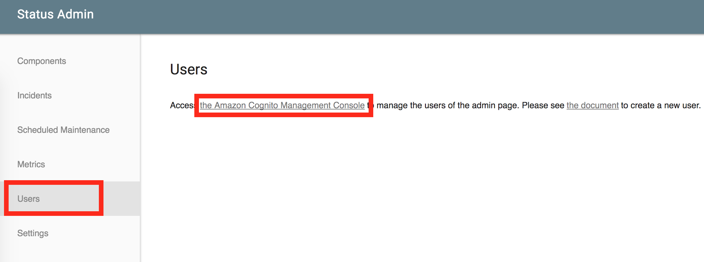
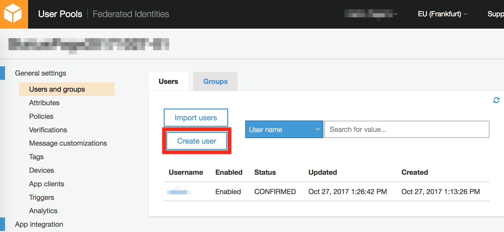
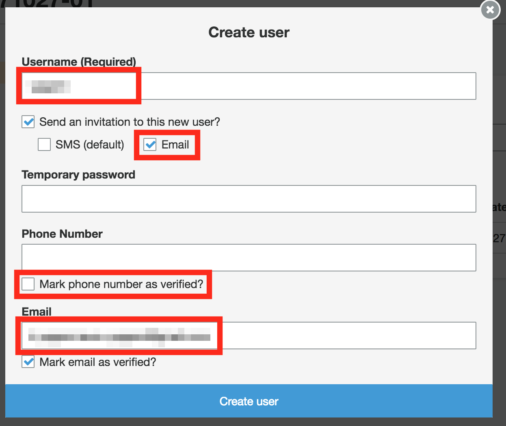

This page tells you how to add a new admin user to manage your status page. LambStatus depends on Amazon Cognito to manage admin users. A new user will have the same priviledges as the user created at the launch of the stack.

1. Open 'the Amazon Cognito Console' at first. Easy way to do this is to open the 'Users' tab of the admin page and click the link in the text.

   

2. Click the 'Create user' button.

   

3. Enter a username and email. Also, check the 'Email' to send an invitation and UNcheck the 'Mark phone number as verified?' to prevent an error. Then, click the 'Create user' button.

   

4. The email will be sent to the new user. Now the new user can sign in the admin page!
