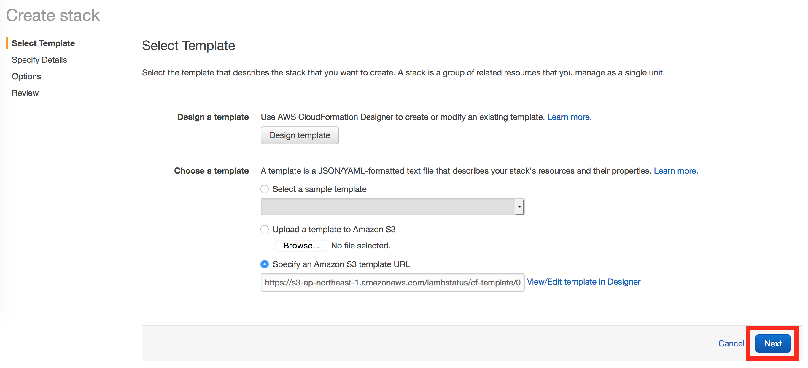
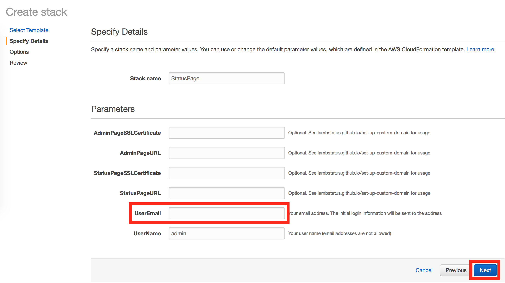
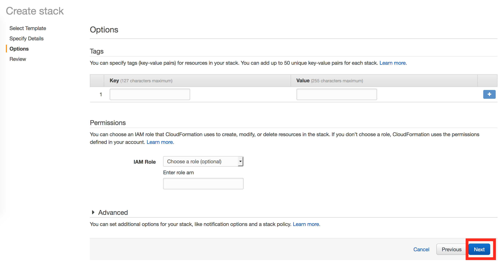
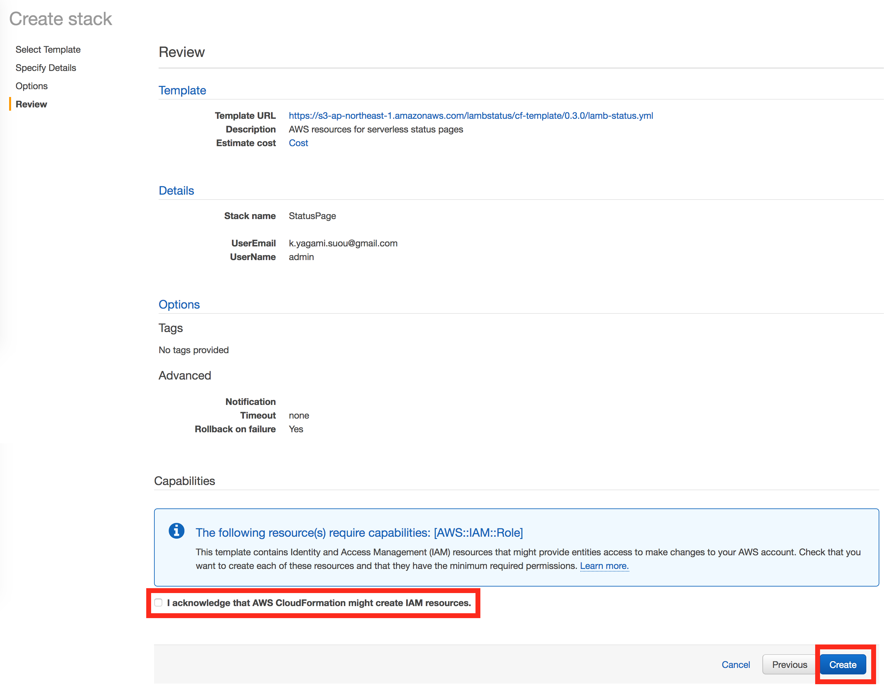
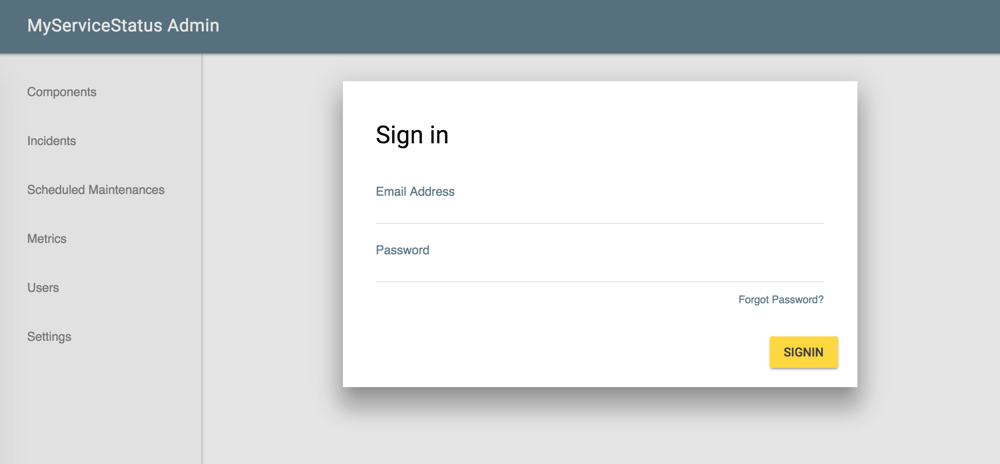

This document lets you create a new LambStatus stack with just a few clicks!

### Prerequisite

AWS account

### Launch your stack

1. Launch a CloudFormation stack by clicking this button 

2. At the 'Create stack' page, click 'Next' (the CloudFormation template is already specified)!

3. Enter your email address and click Next. The initial account information will be sent to this address.

4. Click Next again.

5. Check the acknowledgment checkbox at the bottom and click Create. The checkbox tells the template will create new IAM resources. [Check this part](https://github.com/ks888/LambStatus/blob/master/cloudformation/lamb-status.yml#L46-L174) of the template if you're worried.

6. Now the process to create the stack is ongoing. It may take 10-20 minutes, mainly due to the CloudFront settings. When the stack has been created, the email will be sent to the email address you've entered.

7. Click the link in the email, and sign in to admin console.

8. Congrats! The your own status page is there! Why don't you create some components or incidents? Or you may check [our demo page](https://demo-admin.lambstatus.org/) to see the usage.

### Troubleshooting

* There is no email from the CloudFormation stack

&nbsp;&nbsp;&nbsp;*-> Check the spam folder. The email comes from `no-reply@verificationemail.com`.*

* Failed to create the stack

&nbsp;&nbsp;&nbsp;*-> Some AWS regions are not available mainly due to the lack of Amazon Cognito support. [Here](/supported-aws-regions) is the list of supported regions.* 
