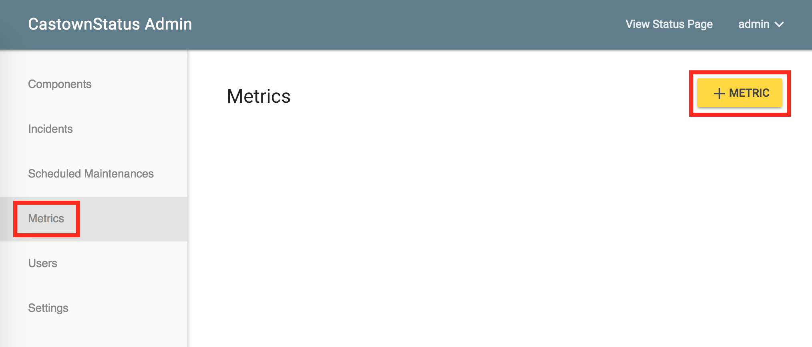
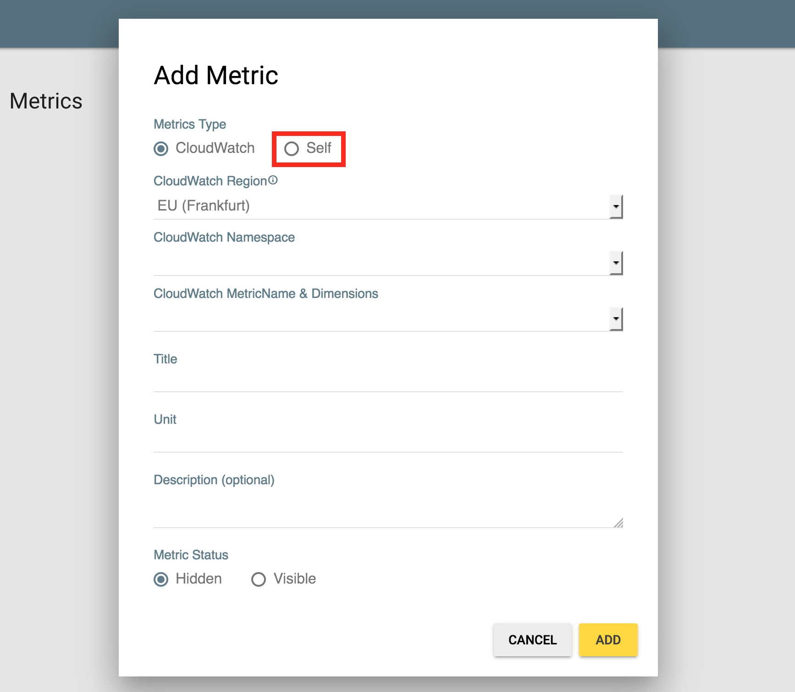
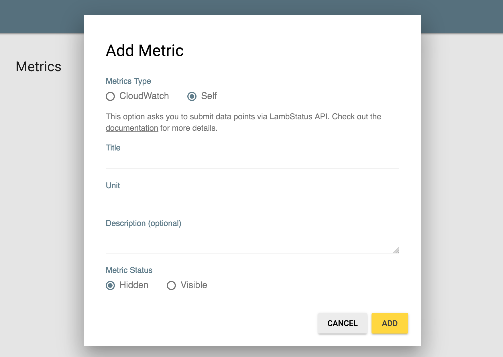
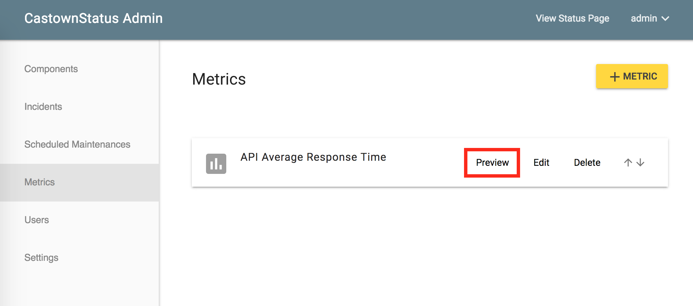
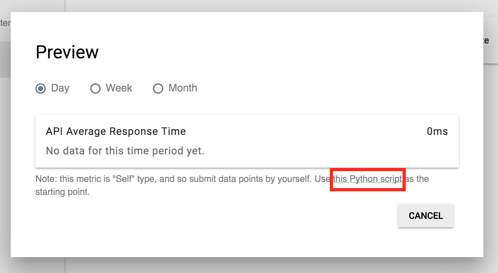
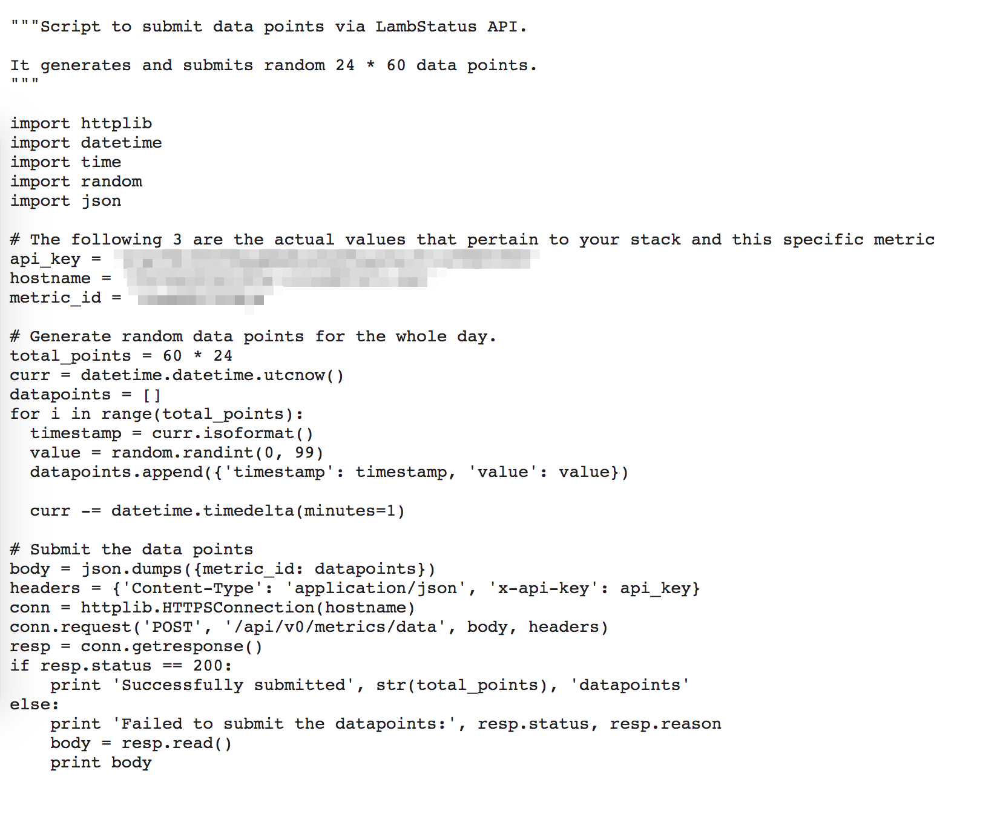
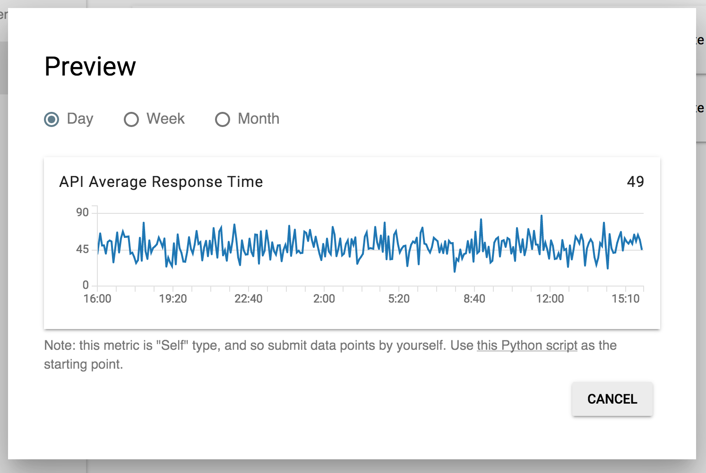

LambStatus has the APIs to integrate with other systems. The APIs enable you to change the component's status, create a new incident and so on.

This page introduces the **Metrics API**. With this, you can submit the metrics data your monitoring systems collect and show the data in the status page. Read [the API docs](https://lambstatus.github.io/apidocs/) for other APIs.

### Set up

At first, you need to create a metric to submit your data points.

1. Visit the 'Metrics' tab of the admin page and click the '+ Metric' button.

2. Choose the 'Self' option. The metric must be the 'Self' type to submit the data points via API.

3. Enter other parameters as you want and click the "ADD" button.

### Submit the data points

Now you can submit the data points using the API. The steps below use the python script prepared for this, but you may write your own script seeing [the API docs](https://lambstatus.github.io/apidocs/#submit-data-points).

1. Click the 'Preview' button of the metric you've just created.

2. Click the link to the script in the dialog.

3. Copy and paste the script and run it on your local machine. The script randomly generates the data points for the past 24 hours and submits them.

4. Reopen the 'Preview' dialog. The data points you've just sent must be shown!

