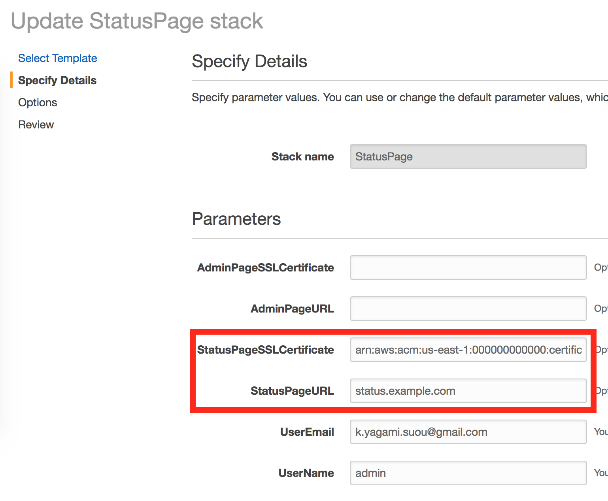

By default, the status page has the url like 'abcdefghi.cloudfront.net'. The steps below explain how to set up your custom domain.

*Note: you don't need to do that on creating a new stack. You can do it later.*

### Prerequisite

* A SSL/TLS certificate for your custom domain, managed by AWS Certificate Manager (ACM)

&nbsp;&nbsp;&nbsp;Due to [the limitation of the AWS](http://docs.aws.amazon.com/AmazonCloudFront/latest/DeveloperGuide/cnames-and-https-requirements.html#https-requirements-aws-region), you must have the certificate in **the US East (N. Virginia) region**. See [this page](http://docs.aws.amazon.com/acm/latest/userguide/import-certificate.html) to import your certificate into ACM, or you may [request a new one](http://docs.aws.amazon.com/acm/latest/userguide/gs-acm-request.html)

### Set up

You need to update your LambStatus stack first. Then, configure the DNS service.

1. Open [the CloudFormation console](https://console.aws.amazon.com/cloudformation) and update your LambStatus stack. On updating, specify `StatusPageSSLCertificate` and `StatusPageURL` parameters.

* `StatusPageSSLCertificate`: the ARN of an AWS Certificate Manager certificate, such as 'arn:aws:acm:us-east-1:000000000000:certificate/00000000-0000-0000-0000-000000000000'.
* `StatusPageURL`: the domain name of your status page.
* You may specify `AdminPageSSLCertificate` and `AdminPageURL` to change the URL of the admin page.

This update takes 10-20 minutes since it changes the CloudFront settings.

2. Configure the DNS service

If you're using Route53, [perform the procedures here](http://docs.aws.amazon.com/Route53/latest/DeveloperGuide/routing-to-cloudfront-distribution.html#routing-to-cloudfront-distribution-config). If not, use the method provided by your DNS service provider to add a CNAME resource record set to the hosted zone for your domain.
