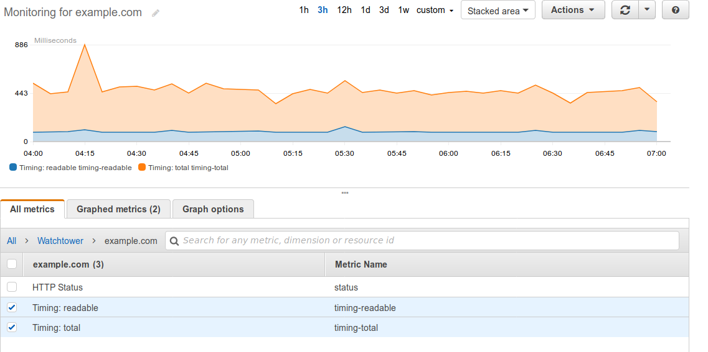

LambStatus doesn’t support custom HTTP(S) endpoint monitoring out-of-the box. This guide describes how to set up serverless HTTP(S) monitoring with AWS Lambda and AWS CloudWatch. Monitoring data collected this way can be displayed in LambStatus. The guide uses the [lambda-watchtower](https://github.com/wmnnd/lambda-watchtower) script but can easily be adapted to any custom monitoring script.




### Create an IAM Role

Before setting up monitoring, an IAM Role with the permissions to store CloudWatch metrics needs to be set up.

1. Open the [IAM service](https://console.aws.amazon.com/iam/) dashboard, select *Policies* from the left-hand menu. Create the following policy and give it a suitable name (e. g. CloudWatch-putMetricDataPermission”):

```json

{
	"Version": "2012-10-17",
	"Statement": [
		{
			"Effect": "Allow",
			"Action": "cloudwatch:PutMetricData",
			"Resource": "*"
		}
	]
}
```
2. Select *Roles* from the left-hand menu. Create a new role  (e. g. named “watchtower-role”) with Lambda as the target service and attach the policy created in the previous step.


### Create a Monitoring Function

Now the function that performs the HTTP(S) monitoring needs to be set up on Lambda.

1. Open the [Lambda dashboard](https://console.aws.amazon.com/lambda/), click on “Create a function”, enter a name (e. g. named “Watchtower-ping”), select the Node.js runtime and the IAM role created earlier. Confirm with “Create function”.
2. Insert the contents of `index.js` from the [lambda-watchtower GitHub repository](https://github.com/wmnnd/lambda-watchtower) into the Lambda script editor.
3. Save the new function by clicking on “Save”.

### Configuring a CloudWatch Rule

Finally, CloudWatch needs to be configured to call the Watchtower Lambda function every five minutes.

1. Open the [CloudWatch Dashboard](https://console.aws.amazon.com/cloudwatch/), click on “Rules” in left-hand menu. Then select “Create rule” and select the “Schedule” event source.
2. Pick an execution interval for the monitoring script. Five minutes is usually a good choice here to avoid additional fees for CloudWatch.
3. Click on “Add target” and select the Lambda function created earlier.
4. Click on “Configure input” and select “Constant (JSON text)”. Now insert the options with the Watchtower script should be executed. Here is an example configuration:

```json

{
	"targets": [
		{
			"url": "https://www.example.com",
			"name": "example.com"
		}
	],
	"timings": ["readable", "total"],
	"timeout": 5000,
	"namespace": "Watchtower"
}
```
All available options are listed in the [Watchtower README](https://github.com/wmnnd/lambda-watchtower/blob/master/README.md).

5. Confirm by clicking on “Configure details”, name the rule and save it with a click on “Create rule”.

---

### That’s it!
Wait until the monitoring script has been called at least once. You can now add the new metrics to your status page from the LambStatus admin page.
