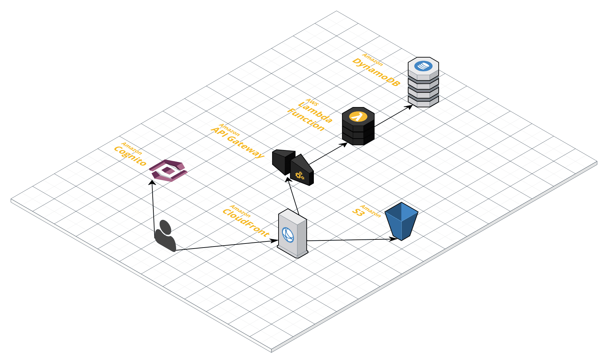

This page describes how to set up the development environment. Also, the project structure is explained as it is helpful to understand the codebase.

* [Set up the development environment](#set-up)
* [Project structure](#project-structure)

**If you have any question, feel free to open [a new issue](https://github.com/ks888/LambStatus/issues/new) or ask at [the chat room](https://gitter.im/ks888/LambStatus).**

### Set up

#### Prerequisite

* Node.js (v8.10.0)

#### Create a CloudFormation stack

1. Clone the repository and go to the cloned directory

`git clone https://github.com/ks888/LambStatus && cd LambStatus`

2. Install all dependencies

`npm run install`

3. Add a '.env' file at the root of this repo based on `.env-example`. At least, you need to write your email address to the 'USER_EMAIL' line because the initial login information will be sent to the address.

4. Launch CloudFormation stack

`npm run cloudformation:create`

If the command returns an error, make sure you properly configured [the AWS credentials](http://docs.aws.amazon.com/cli/latest/userguide/cli-chap-getting-started.html#cli-quick-configuration).

5. Now the process to create the stack is ongoing. When the stack is created, the email will be sent to the email address.

#### Change AWS resources created by CloudFormation

1. Make your change.

2. Update the CloudFormation stack

`npm run cloudformation:update`

#### Change server-side code

1. Go to the 'lambda' directory

`cd packages/lambda`

2. Make sure the tests pass

`npm run test`

3. Make your change. Add tests for your change. Make the tests pass

4. (If necessary, deploy your functions)

`npm run deploy`

Note: LambStatus depends on [apex](http://apex.run/) to deploy lambda functions. [Please install it](http://apex.run/#installation) if the `apex` command is not found.

#### Change client-side code

1. Go to the 'frontend' directory

`cd packages/frontend`

2. Make sure the tests pass

`npm run test`

3. Make your change. Add tests for your change. Make the tests pass

4. Run the local server

`npm run start         # Run the admin page server at localhost:3000`

`npm run start:status  # Run the status page server at localhost:3002`

### Project Structure



These 3 directories under the repository are especially important for this system:

* `./cloudformation`: the CloudFormation template. It describes all the AWS resources including Lambda, API Gateway, DynamoDB, etc.
* `./packages/lambda`: server-side code. All the server-side code runs as the Lambda Functions.
* `./packages/frontend`: client-side code. These are deployed to the S3 and served via CloudFront.

Here is the contents of each directory:

```
.
├── cloudformation
|   ├── bin                    --- the scripts to create the CloudFormation stack
|   └── lamb-status.yml        --- the CloudFormation template file
└── packages
    ├── lambda
    |   ├── bin                --- the scripts to build and deploy the lambda functions
    |   ├── config             --- the webpack config file to build the codes
    |   ├── src
    |   |   ├── api            --- the entrypoints of Lambda functions. Handles the event from the API Gateway
    |   |   ├── aws            --- the classes to access AWS resources
    |   |   ├── db             --- the classes to access the database
    |   |   ├── model          --- the models
    |   |   └── utils          --- the utilities
    |   ├── test               --- tests. Same structure as ./src
    |   └── package.json       --- package.json file for lambda functions
    └── frontend
        ├── bin                --- the scripts to build and deploy the frontend
        ├── build              --- the webpack config file to build the codes
        ├── config             --- the environment-dependent config files
        ├── src
        |   ├── actions        --- Redux actions
        |   ├── components     --- React components
        |   ├── reducers       --- Redux reducers
        |   ├── utils          --- the utilities
        |   ├── admin-page.js  --- the entrypoint of the admin page
        |   └── status-page.js --- the entrypoint of the status page
        ├── test               --- tests. Same structure as ./src
        └── package.json       --- package.json file for frontend
```

