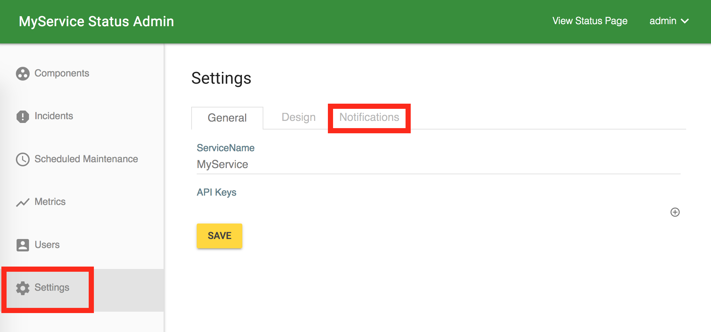
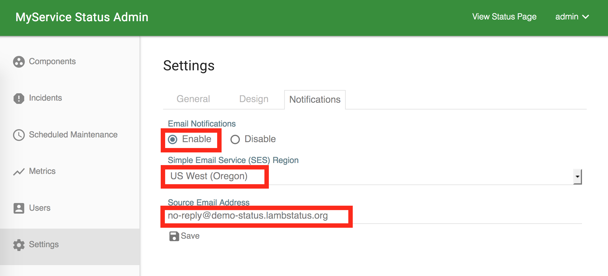
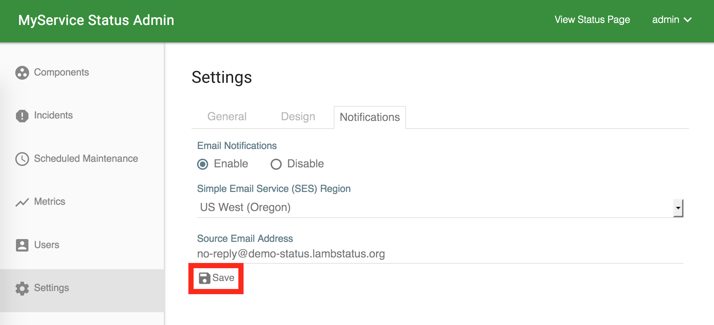
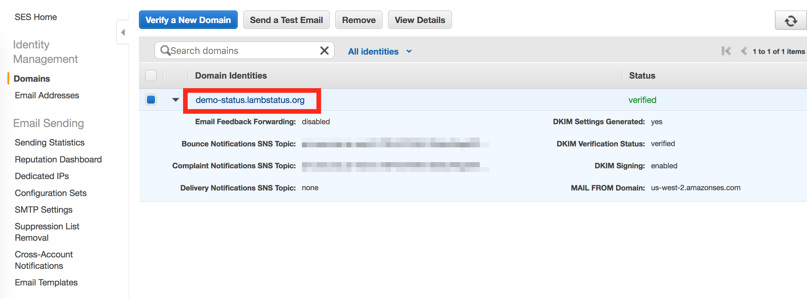
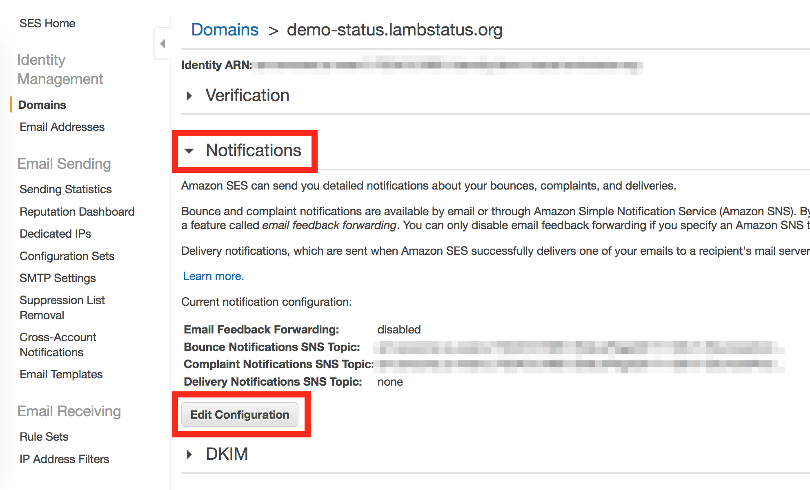
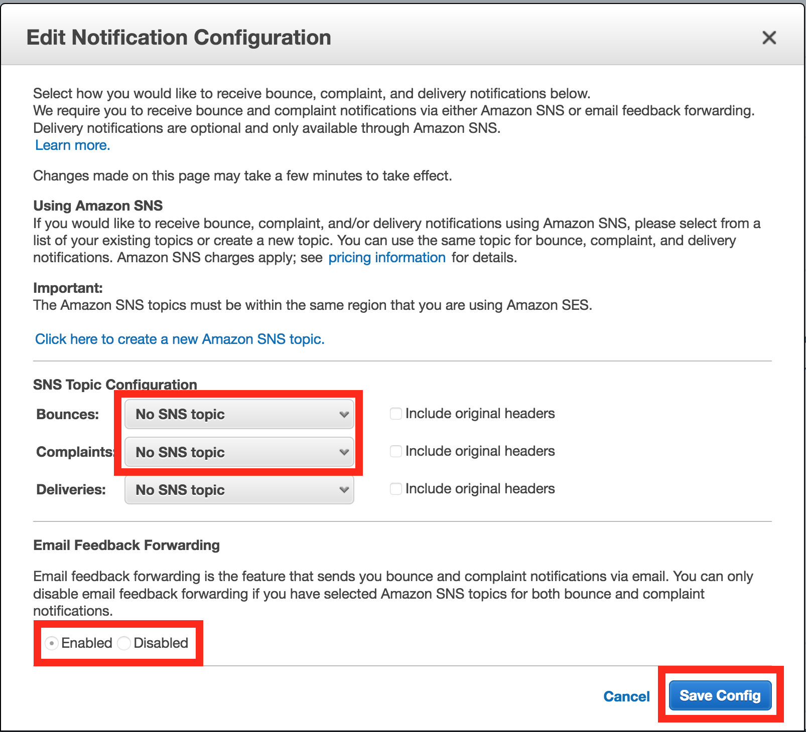

By the integration with the Amazon Simple Email Service (SES), you can send the email notifications to your users whenever incidents are created/updated and maintenances are scheduled/updated. The page explains how to set up the notifications.

### Prerequisite

* Verified email address or domain

&nbsp;&nbsp;&nbsp;See [the AWS docs](https://docs.aws.amazon.com/ses/latest/DeveloperGuide/verify-addresses-and-domains.html) for the verification process.

* Moved out of the SES Sandbox

&nbsp;&nbsp;&nbsp;See [the AWS docs](https://docs.aws.amazon.com/ses/latest/DeveloperGuide/request-production-access.html) for instructions. Here is the example of the 'Use Case Description' form:

&nbsp;&nbsp;&nbsp;Used to support the subscription feature of our status page. A visitor to our page can choose to subscribe to our notification emails which will be sent when an incident happens to our service. A user can unsubscribe to our email by clicking 'Unsubscribe' button at the footer of the email. Bounces and complaints will be notified through SNS and our AWS lambda function will remove those email addresses from our recipient lists. The increase amount is calculated from the number of visitors to our service.

&nbsp;&nbsp;&nbsp;...and LambStatus actually works like this!

### Set up

1. Open the notification settings. Then, enable the email notifications and enter the source region and email address. The region is the SES region of your verified address.

2. Click the 'Save' button. To check the validity of the source email address, LambStatus sends the test email to 'success@simulator.amazonses.com', the test email address [the SES provides](https://docs.aws.amazon.com/ses/latest/DeveloperGuide/mailbox-simulator.html).

3. Next, configure [bounces and complaints notifications](https://docs.aws.amazon.com/ses/latest/DeveloperGuide/monitor-sending-using-notifications.html). At first, open the Amazon SES console and click the verified email address or domain. Then, click the 'Notifications' tab and the 'Edit Configuration' button.

4. In the dialog, configure the SNS topic of bounces and complaints. The topic '[Your CloudFormation Stack]-BouncesAndComplaintsNotification' should be there for this purpose. Then, disable Email Feedback Forwarding and click the 'Save Config' button.

That's it! Check the email icon at the header of your status page!
