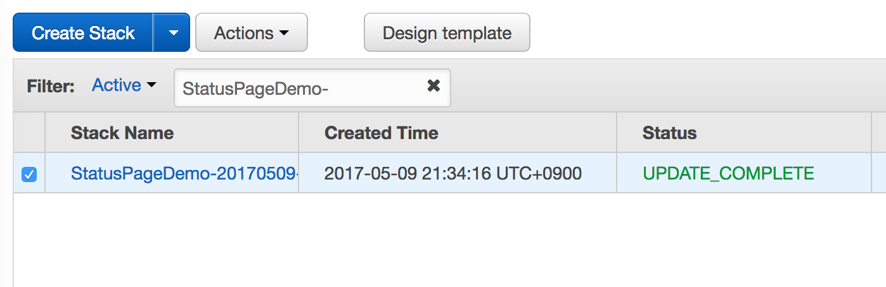
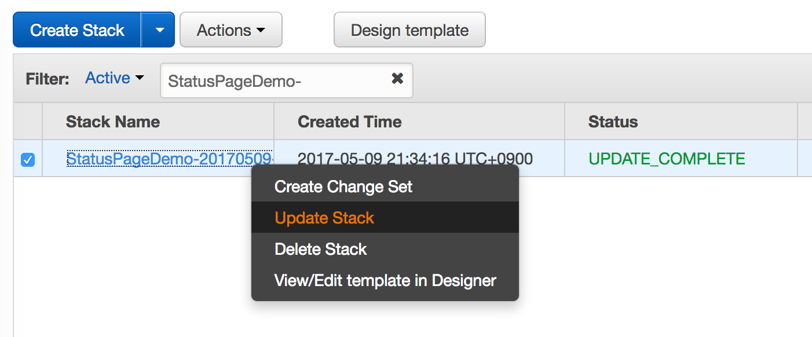
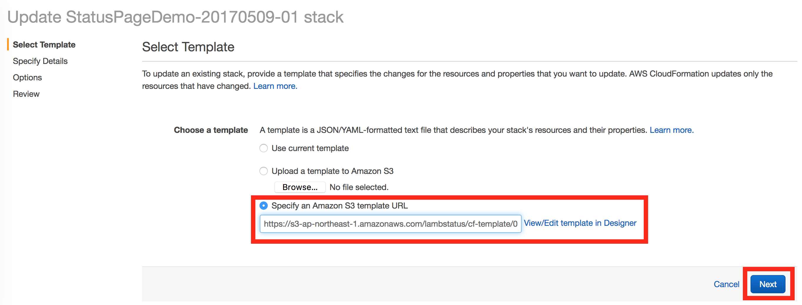
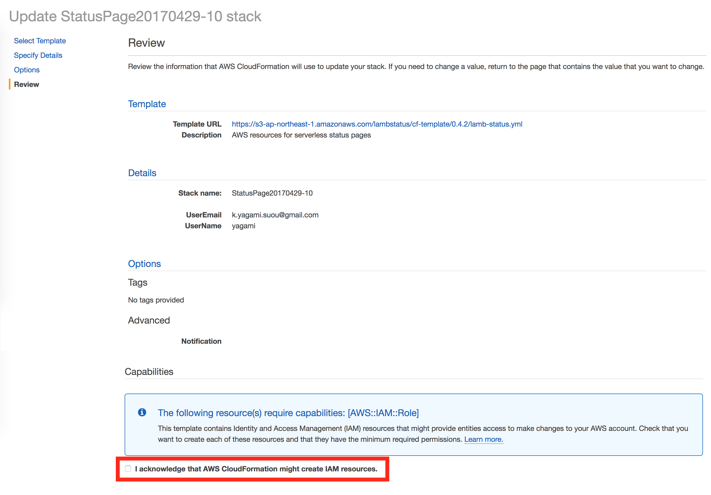

If the newer version of LambStatus is available, you can update the existing CloudFormation stack by following the steps below.

1. Open the CloudFormation console and select the stack you want to update.

2. Choose 'Update Stack' action.

3. Select 'Specify an Amazon S3 template URL' and enter the latest template url (`{{templateLink}}`). Then, click the 'Next' button.

4. Click the 'Next' button 2 times.

5. Check the acknowledgment checkbox at the bottom and click the 'Update' button.

6. Now the process to update the stack is ongoing. When the status of the stack at the console becomes 'UPDATE_COMPLETE', it's done! Check the new features!

